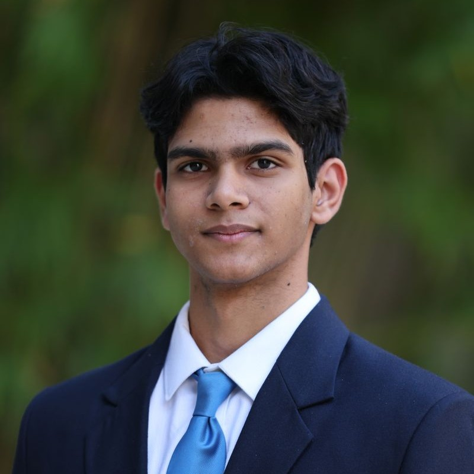

  
  

    <h1 class="title">Shayaan Nesargi</h1>
    

      <a href="mailto:shayaan.nesargi@gmail.com" style="display:inline-flex;align-items:center;gap:0.5rem;text-decoration:none;color:var(--color-accent-2);">
        <svg xmlns="http://www.w3.org/2000/svg" width="16" height="16" fill="currentColor" class="bi bi-envelope" viewBox="0 0 16 16" style="width:20px;height:20px;opacity:0.9;"> <path d="M0 4a2 2 0 0 1 2-2h12a2 2 0 0 1 2 2v8a2 2 0 0 1-2 2H2a2 2 0 0 1-2-2zm2-1a1 1 0 0 0-1 1v.217l7 4.2 7-4.2V4a1 1 0 0 0-1-1zm13 2.383-4.708 2.825L15 11.105zm-.034 6.876-5.64-3.471L8 9.583l-1.326-.795-5.64 3.47A1 1 0 0 0 2 13h12a1 1 0 0 0 .966-.741M1 11.105l4.708-2.897L1 5.383z" stroke="currentColor" stroke-width="0.5"/></svg>
        Email
      </a>
      <a href="https://www.linkedin.com/in/shayaan-nesargi" target="_blank" rel="noopener" style="display:inline-flex;align-items:center;gap:0.5rem;text-decoration:none;color:var(--color-accent-2);">
        <svg stroke="currentColor" fill="currentColor" stroke-width="0" viewBox="0 0 24 24" aria-hidden="true" style="width:20px;height:20px;opacity:0.9;" xmlns="http://www.w3.org/2000/svg"><path d="M20 3H4a1 1 0 0 0-1 1v16a1 1 0 0 0 1 1h16a1 1 0 0 0 1-1V4a1 1 0 0 0-1-1zM8.339 18.337H5.667v-8.59h2.672v8.59zM7.003 8.574a1.548 1.548 0 1 1 0-3.096 1.548 1.548 0 0 1 0 3.096zm11.335 9.763h-2.669V14.16c0-.996-.018-2.277-1.388-2.277-1.39 0-1.601 1.086-1.601 2.207v4.248h-2.667v-8.59h2.56v1.174h.037c.355-.675 1.227-1.387 2.524-1.387 2.704 0 3.203 1.778 3.203 4.092v4.71z"></path></svg>
        LinkedIn
      </a>
    

  

Hi, I'm Shayaan Nesargi, a Finance student at the University of Florida’s Warrington College of Business with a minor in Computer and Information Science and Engineering. I’m interested in financial analysis, AI-driven decision-making, FinTech, and applying technical tools to real business problems.

I currently serve as a Student Assistant at the UF AI2 Center and as a Resident Assistant with UF Housing and Residence Life, where I support student operations, event logistics, and community engagement. I also work as a Communications Investment Analyst for Diverse Invested Student Securities (DISS) Capital, helping manage a $1.7M+ virtual capital base and contributing investment research, valuation work, and stock pitches.

My work has centered on combining data analysis and business strategy. I’ve built skills in Python, particularly with Pandas and NumPy, and I enjoy translating quantitative findings into practical financial insights. In addition to academics and work, I’m involved in the Finance Professional Development program, the Leadership Development Program, the Computing Student Union, the Data Science and Informatics Club, and the UF AI Club.

Outside the classroom, I’m interested in prediction markets, volleyball, acoustic guitar, travel, hiking, and chess.